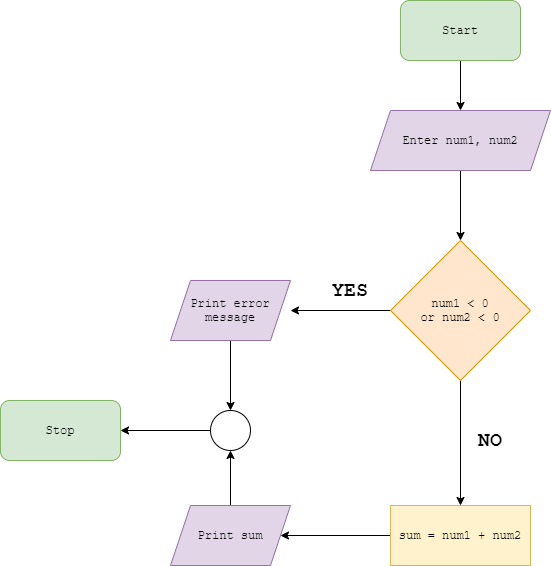

# Algorithm Flows

The following exercise is split in various mini tasks. You are to define the algorithm flow for each of the tasks below. You can do that by either **writing down the steps**, or by **drawing a flow chart** for it (it can be done simply with **pen and paper**, or using some **online tool** like [Diagrams](https://app.diagrams.net/)).

Here's an example:

- ### Example
Return the sum of two positive numbers

#### Writing down the Steps
```
Step 1: Start
Step 2: Read values num1 and num2. 
Step 3: If num1 < 0 OR num2 < 0
            Print error message
            Go to step 6
Step 4: Add num1 and num2 and assign the result to variable sum.
        sum = num1 + num2 
Step 5: Display sum 
Step 6: Stop
```

#### Drawing a flow chart


---

With the above example in mind, define the flow of the following algorithms:

- ### Algorithm 1
Find the largest number among two numbers

Step 1: Start
Step 2: Read the values of the two numbers
Step 3: Compare the values: if (num1 < num2) returns true, the num2 is bigger. If the condition returns false, then num1 is bigger.
Step 4: Print the largest number.
Step 5: Stop

- ### Algorithm 2
Find the largest number among three numbers

Step 1: Start
Step 2: Read the values of the three numbers
Step 3: Compare the values: 

if (num1 > num2 && num1 > num3), num1 is the largest number.
if (num2 > num1 && num2 > num3), num2 is the largest number.
if (num3 > num2 && num3 > num1), num3 is the largest number.

Step 4: Print the largest number.
Step 5: Stop

- ### Algorithm 3
Given a list of positive numbers, return the largest number on the list

Step 1: Start
Step 2: Create a variable that later will hold the value of the largest number on the list.
Step 3: Check for negative values on the list
Step 4: Go through every item from the list: for (let i = 0; i < list.length; i++) and check if any number is less than 0: if (list[i] < 0) print an error message and go to Step 7.
Step 5: During the iteration, compare all numbers: if (list[i + 1] != null && list[i] < list[i + 1]). After each iteration, copy the value of the current largest number in the variable created in Step 2.
Step 6: After the end of the loop, print the variable created in Step 2 that should contain the largest number.
Step 7 : Stop

- ### Algorithm 4
Determine wheter a given number is even or odd

Step 1: Start
Step 2: Read the value of the given number.
Step 3: Check if the number is even or odd: if (number % 2 == 0), the number is even. If the condition returns false, the number is odd.
Step 4: Stop.

- ### Algorithm 5
Calculate the sum of the first 50 numbers (from 1 to 50)

Step 1: Start
Step 2: Create a variable that will contain the sum of all numbers.
Step 3: By using a loop, iterate through every number from 0 to 50: 
let i = 0;
while (i <= 50) sum += i; i++
Step 4: Print the sum.
Step 5: Stop